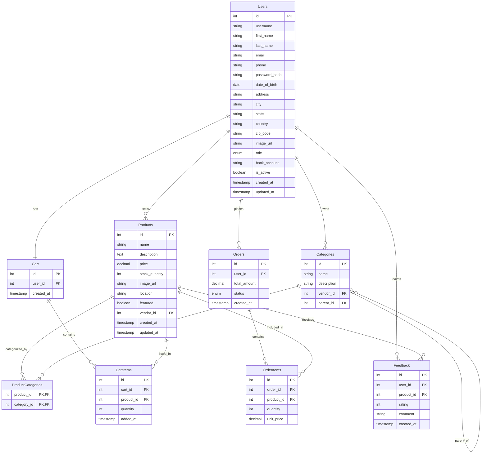

# 🌐 LocalLink — Sustainable Community Market Platform

**LocalLink** is a web-based platform that connects local communities to sustainable and ethical products. It empowers local vendors, simplifies conscious shopping, and fosters circular economies — all through clean, modular, and collaborative code.

---

## 🎯 Project Scope

### ✅ Theme/Name

- **Project Name**: `LocalLink`
- **Theme**: Sustainable local economy, community-first commerce, and ethical sourcing.

---

## 🧩 System Design

### 📐 Database Schema

LocalLink supports the following core features:

- User authentication and roles (Customer, Vendor, Admin)
- Product listing and browsing
- Cart management
- Order creation and tracking

You can visualize the schema using [dbdiagram.io](https://dbdiagram.io) or any similar tool.

#### ⚙️ Schema Overview (ER Diagram Structure)



---

## 🛠️ API Features

The backend exposes RESTful APIs for:

- **User Management**

  - `POST /api/register`
  - `POST /api/login`
  - `GET /api/profile`

- **Product Data**

  - `GET /api/products`
  - `POST /api/products` _(vendor only)_
  - `GET /api/products/:id`

- **Cart Handling**

  - `GET /api/cart`
  - `POST /api/cart`
  - `DELETE /api/cart/:itemId`

- **Order Management**
  - `POST /api/orders`
  - `GET /api/orders`

---

## 🧪 Local Development

### 📦 Python + Flask (with `uv` environment)

Make sure you have `uv` (the Python package manager from the creators of `pipx` and `uvicorn`) installed. If not, install it [here](https://github.com/astral-sh/uv).

### 1. Initialize Project

```bash
uv init
```

### 2. Add Dependencies

```bash
uv add flask                # web framework
uv add flask-sqlalchemy     # ORM
uv add flask-migrate        # DB migrations
uv add psycopg2-binary      # DB driver
uv add pytest               # for testing
uv add flask-jwt-extended   # for authentication
uv add pydantic             # for data validation
uv add python-dotenv        # for environment variables
uv add taskipy              # for task automation
```

```toml
    [tool.taskipy.tasks]
    fr = "flask --app app run --port 8000 --reload --debug"
```

### Run server:

```bash
uv run task fr
```

### 3. Run Tests (Optional)

```bash
uv run pytest -s -v
```

### 4. Set Up Database Migrations

```bash
uv run flask db init
uv run flask db migrate -m "Initial migration"
uv run flask db upgrade
```

---

## 🔗 Contribution & Integration

- Write modular and documented code for smooth group collaboration.
- Follow naming conventions and RESTful design.
- Use migrations for all DB changes.
- Keep logic clean and business rules abstracted in service layers.

---

## 📄 License

MIT — feel free to use, modify, and share!
